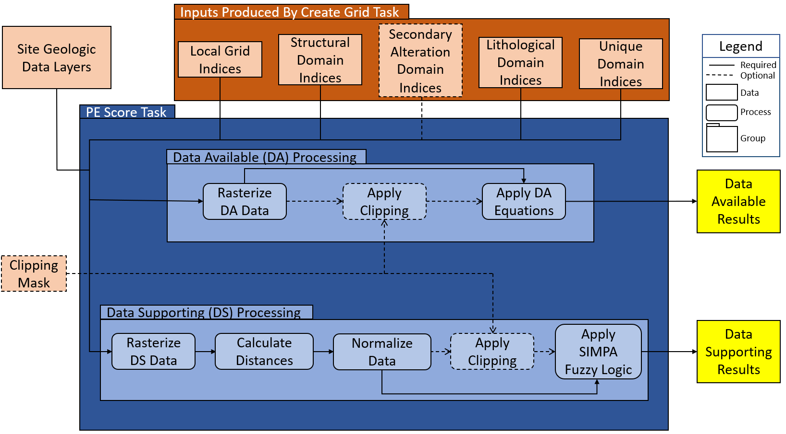

<!--
misc notes:
 submission instructions & example: https://joss.readthedocs.io/en/latest/submitting.html
-->

---
title: 'A Python Tool for Predicting and Assessing Unconventional Rare-Earth and Critical Mineral Resources'
tags:
  - Python
  - Rare-Earth Elements
  - Geology
  - Coal Formations
  - subsurface
authors:
  - name: Patrick Wingo
    orcid: 0000-0003-3934-7733
    corresponding: true
    affiliation: "1, 2"
  - name: Devin Justman
    orcid: Author Without ORCID
    affiliation: "1, 2"
  - name: C. Gabriel Creason
    orcid: 0000-0002-3440-1174
    affiliation: "1, 3"
  - name: Mackenzie Mark-Moser
    orcid: 0000-0001-5138-5527
    affiliation: "1, 2"
  - name: Scott Montross
    orcid: 0000-0002-6551-7700
    affiliation: "1, 2"
  - name: Kelly Rose
    orcid: 0000-0001-6130-4727
    affiliation: 1

affiliations:
 - name: National Energy Technology Laboratory (NETL), USA
   index: 1
 - name: NETL Support Contractor, USA
   index: 2
 - name: Oak Ridge Institute for Science and Education (ORISE), USA
   index: 3

date: 31 March 2023
bibliography: paper.bib

---

# Summary

[U]{.underline}nconventional [R]{.underline}are-earth elements & [C]{.underline}ritical minerals (URC) [@osti_1891489] 
are crucial to a growing number of industries worldwide [@BALARAM20191285]. Critical Minerals (CM) are minerals used in
manufacturing which are essential to economic and national security while being vulnerable to supply disruption through 
any number of external factors [@osti_1891489]. _Unconventional_ CM resources contrast with conventional CM resources 
in that they are sourced from geologic or byproduct hosts distinctly separate from the mechanisms which establish 
conventional CM deposits; such unconventional sources include _in situ_ geologic deposits and byproducts of industrial 
extraction [@osti_1891489].
 
The extraction and recovery of conventional CM is a complex process traditionally involving strip mining, 
which is both expensive and environmentally destructive [@BALARAM20191285]. Recent research has revealed that 
coralliferous sediments may act as unconventional CM sources containing REE in significant concentrations 
[@SEREDIN201267]; determining the likelihood and location of these resources in sedimentary basins, however, is both
complex and challenging. To address this, a new method of evaluating the potential occurrence of URC resources using a 
series of validated heuristics has been developed [@CREASON2023]. While the entire process can be carried out manually 
using a collection of tools, a new, standalone software tool has been developed to streamline and expedite the process: 
NETL's `URC Resource Assessment Tool`.

# Statement of need

The `URC Resource Assessment Tool` applies the data analysis methods outlined in @CREASON2023, the tool's companion 
paper. This tool is a complete application written in Python and built on top of several open-source libraries (see the 
[Support Libraries](#support-libraries) section). The intended users for this tool are geologists and geospatial 
scientists who are looking to better understand the mode and spatial distribution of potential URC resource occurrences 
in sedimentary basins.

There are several ways that the `URC Resource Assessment Tool` can be configured to run, but fundamentally the tool 
takes in a collection of spatial domains which fall under the Lithological, Structural, and Secondary Alteration 
categories defined by the Subsurface Trend Analysis (STA) method [@sta2019]. These domains are combined, clipped 
to a researcher-defined boundary, and grided to cells of a research-specified dimension (see \autoref{fig:cg_flow} for 
overview of the process).

From this point, a Data Availability (DA) and / or a Data Supporting (DS) analysis can be undertaken by the tool 
(\autoref{fig:pes_flow}); both analyses will operate on a vector-based spatial dataset describing the target formation,
following the labelling scheme specified in the supplementary material in @CREASON2023. These data are rasterized 
according to the grid specification of the aforementioned domains with each cell tagged with the appropriate set of 
indices. In the case of a DA analysis, each pixel in the rasterized data is evaluated according to \autoref{eq:da} as 
described by @CREASON2023, producing a DA score for each cell that is unique to each geologic resource type. For the DS 
analysis, Spatial Implicit Multivariate Probability Assessment method [@simpa2019] is applied using a series of 
predefined Fuzzy Logic statements, which encompass the application of equations \autoref{eq:ds}, \autoref{eq:dsm}, and
\autoref{eq:pe}. 

The `URC Resource Assessment Tool` can be run either using the standalone GUI, or as a command-line tool. The former 
configuration is useful for a guided approach to executing the URC mineral-related analyses and previewing the results 
in the tool itself, whereas the latter is useful for integration of the tool into a workflow as part of a batch 
process. Regardless of how it is run, the results of the requested analyses are written to GeoTIFF files, which can be 
imported into most geospatial information systems analysis tools. Optionally, when run from the GUI the results 
of an analysis can be previewed within the tool itself (\autoref{fig:urc_out}).

# Support Libraries

In addition to several core Python libraries, The following 3rd-party libraries were used to create this tool:

* [GDAL](https://www.gdal.org): Used for general spatial data management and calculations [@gdal2022].
* [NumPy](https://numpy.org/): Handled vector math and general numeric array management [@harris2020array]. 
* [Pandas](https://pandas.pydata.org/): Utilized for statistical calculations for the _Data Available_ (DA) scoring 
  [@reback2020pandas].
* [SIMPA](https://edx.netl.doe.gov/dataset/simpa-tool): Tool for processing spatially explicit raster data using fuzzy 
  logic statements. Used in _Data Supporting_ (DS) scoring [@simpa2019].
* [PyQt](https://riverbankcomputing.com/software/pyqt/): Framework used to build the graphical user interface (GUI) for
  the tool; built on [Qt](https://www.qt.io) [@pyqt2022; @qt2022].
* [PyOpenGL](https://pyopengl.sourceforge.net/): Wrapper for [OpenGL](https://www.opengl.org/) API; used for map 
  visualization [@pyOGL2022; @openGL2017].
  * PyOpenGL-accelerate: Optional library which can increase the performance of PyOpenGL [@pyOGL2022].
* [pyGLM](https://github.com/Zuzu-Typ/PyGLM): Python port of the [GLM](https://glm.g-truc.net/0.9.9/) library; used for
  graphic-specific mathematics [@pyglm2022;@glm2020].

# Figures

# Equations

\begin{equation}\label{eq:da}
Da_m = \sum {\frac{Da_{m,c}}{D_{r_m}}}
\end{equation}

\begin{equation}\label{eq:ds}
Ds_m = \sum {\frac{Ds_{m,c}}{D_{r_m}}}
\end{equation}

\begin{equation}\label{eq:dsm}
\widetilde{Ds_m} = \widetilde{Ds_{m,c}} \cdot Dr^*_m
\end{equation}

\begin{equation}\label{eq:pe}
PE_m = 1 - [(1 - Ds_m) \cdot (1 - \widetilde{Ds_m})]
\end{equation}

# Acknowledgements & Disclaimer

Disclaimer:  This project was funded by the U.S. Department of Energy, National Energy Technology Laboratory, in part, 
through a site support contract. Neither the United States Government nor any agency thereof, nor any of their employees, 
nor the support contractor, nor any of their employees, makes any warranty, express or implied, or assumes any legal 
liability or responsibility for the accuracy, completeness, or usefulness of any information, apparatus, product, or 
process disclosed, or represents that its use would not infringe privately owned rights.  Reference herein to any 
specific commercial product, process, or service by trade name, trademark, manufacturer, or otherwise does not 
necessarily constitute or imply its endorsement, recommendation, or favoring by the United States Government or any 
agency thereof. The views and opinions of authors expressed herein do not necessarily state or reflect those of the 
United States Government or any agency thereof. 

Acknowledgement: Parts of this technical effort were performed in support of the National Energy Technology Laboratory’s 
(NETL) ongoing research under the Critical Minerals Field Work Proposal by NETL’s Research and Innovation Center. The 
authors are grateful for literature synthesis provided by Jenny DiGuilio, Nicole Rocco, Roy Miller III, and Emily Cameron 
early in the development of the URC resource assessment method. Technical discussions with Davin Bagdonas, Leslie “Jingle” 
Ruppert, and Paige Morkner aided development and led to the advancement of the assessment method. Development and 
validation of the URC method benefited from geologic core and coal samples provided by the University of Wyoming, U.S. 
Geologic Survey, West Virginia Geological and Economic Survey, and Ramaco Carbon. 

# References
