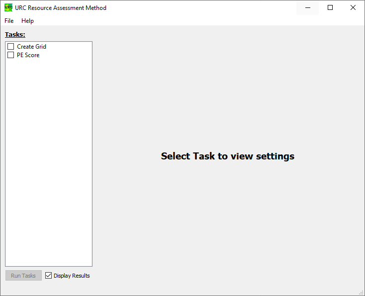
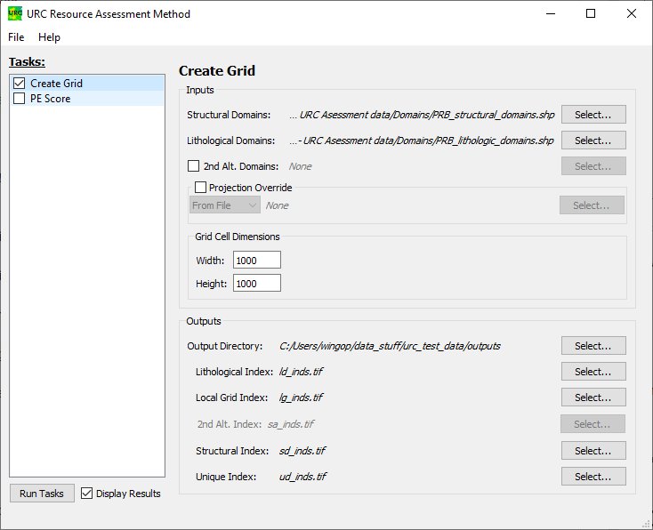
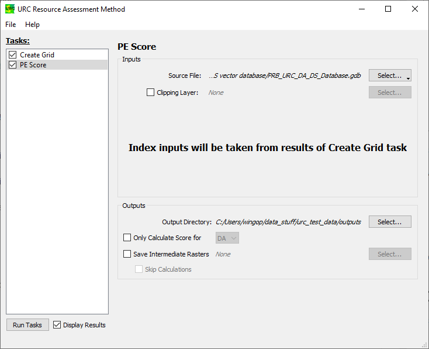
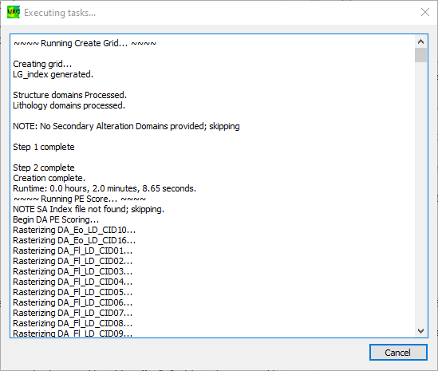
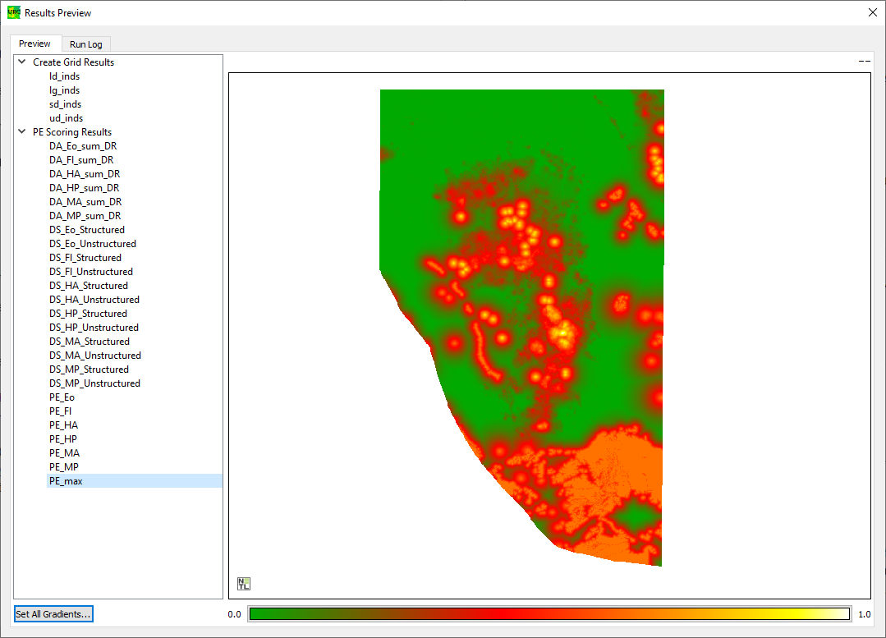
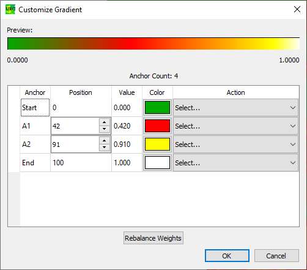

Example Tutorial
================

A bundled version of the [URC Assessment Method tool can be downloaded from EDX](https://edx.netl.doe.gov/dataset/urc-assessment-method).

For this tutorial, we will be simulating a portion of the Powder River Basin Case Study as outlined in {cite:p}`CREASON2022`. 
To do this, we will first need to download the publication's supplementary data from its 
[EDX submission page](https://edx.netl.doe.gov/dataset/urc-assessment-method-publication-supplementary-files). 
Specifically, you will want to download and unzip the file `esm_3.zip`; you will also need to unzip the file 
`ecm_3/PRB- URC Asessment data/DA & DS databases/DA & DS vector database.zip`

Initial Setup
-------------

Launch the ***URC Assessment Method*** tool:
    
* If using the Bundled version of the tool, double-click on **URC_Assessment_Method.exe**.
* If running from source, run `urc_assessment_method.py` with no arguments.

Once the tool is loaded, you should see a window similar to the image above.

Leave the **Display Results** box checked.

Configuring the Create Grid Task
--------------------------------

Check the box next to **Create Grid**; a series of options should appear on the right side.

We will set two of the fields in the _Inputs_ box to some of the files provided in **esm.zip**. These files are 
vector map layers containing domains generated by a knowledge expert using the Subsurface Trend Analysis (STA) 
method, as described by {cite:p}`sta2019`, and will be used as the foundation for creating the raster-based index 
grids used for the [PE Score Task](#configuring-the-pe-score-task). 

Add the Structural and Lithologic Domains as to the _Inputs_ box:
* Click on the **Select...** button to the right of the _Structural Domains_ field. Choose the file
  **ecm_3/PRB- URC Asessment data/Domains/PRB_structural_domains.shp** and click on the **Open** button.
* Click on the **Select...** button to the right of the _Lithological Domains_ field. Choose the file
  **ecm_3/PRB- URC Asessment data/Domains/PRB_lithologic_domains.shp** and click on the **Open** button.

The _Grid Cell Dimensions_ box describes the width and height of each pixel cell in real-world units. The units are
defined by the applied projection; either the current projection of the _Structural Domains_ data source, or the 
projection provided in the _Projection Override_ box. In this example, the width and height are both in _meters_.

Feel free to leave the fields in the _Grid Cell Dimensions_ box (both 1 kilometer). If, however you find that the 
[task execution](#executing-the-tasks) is taking too long to run, you can cancel and increase the grid dimension; a 10
kilometer width and height will significantly reduce the runtime.

The _Outputs_ box allows us to determine where we'd like to save our indexing rasters. We can either give each 
output its own fully qualified file path, or provide a single directory and relative file names. In this case, we'll 
be doing the latter:
* Click on the **Select...** to the right of the _Output Directory_. Choose a directory to store the generated index
  (*.tif) files, and click on **Select Folder**.

Leave the rest of the fields set to their defaults.

Configuring the PE Score Task
-----------------------------

Check the box next to **PE Score**; once again, a series of options should appear on the right side.

Since we are running both tasks at the same time, there is only one _required_ input for this task: an archive of 
geospatial data identified according to the guidelines provided in the appendices of {cite:p}`CREASON2022`. This data 
can come in the form of a FileGeoDatabase (`*.gdb`) or a Spatialite (`*.sqlite`) file. If the _Create Grid Task_ were
omitted, the _Inputs_ box would require the raster index files that were generated with a previous run of the 
_Create Grid Task_.

In the _Inputs_ box, select the data for the Powder River Basin:
* To the right of the _Source File_ label, click on the **Select...** button, and choose the **.gdb file** option in the 
  menu. Navigate to **esm_3/PRB- URC Asessment data/DA & DS databases/DA & DS vector database/DA & DS vector database/PRB_URC_DA_DS_Database.gdb**
  and click **Select Folder**.

For the _Outputs_ box, only the _Output Directory_ needs to be set; this can be the same directory as chosen for the 
_Create Grid Task_:
* Click on the **Select...** to the right of the _Output Directory_. Choose a directory to store the generated 
  scoring files, and click on **Select Folder**.

The remaining settings in the _Outputs_ box are useful for troubleshooting intermediate steps, or only running one of
sets of scores, but are not relevant to this example. 

Executing the Tasks
-------------------

At the bottom of the main window, click on the **Run Tasks** button. A new dialog should popup and proceed to display
log messages.

The _Create Grid_ task should finish quickly; the _PE Score_ task may take up to a few hours to complete.

Previewing the Results
----------------------

The Raster Geotiff (*.tif) files are intended to be further evaluated in GIS software suites such as ESRI's 
_[ArcGIS](https://www.arcgis.com/index.html)_ or the free and Open Source _[QGIS](https://qgis.org/)_. However, 
the results can optionally be previewed once the tasks completed if the **Display Results** check box in the main window
remains checked.

The output files that were created are sorted by task in a list on the left side of the result dialog. Select **PE_max**;
this will bring up a black and white display of the output file, _PE_max.tif_. To change the coloring, click on the 
gradient at the bottom of the dialog. This will bring up a gradient editor.

To the right of the table row with the _Start_ Anchor value, click on the **Select...** dropdown menu and select **Add 
Below**; do this twice. Set the Color and Position values to match the image above (or whatever color values you prefer).
Click **OK**. This will update the color applied to the values for **PE_max** as displayed in the Results Preview dialog.

The results come in three different flavors:
* The **DA_\*_sum_DR** files capture the Data Available estimates for each defined component.
* The **DS_\*_** files capture the Data Supporting estimates for both structure and unstructured components.
* The **PE_\*_** files capture the Potential Enrichment scores for each of the component types, as well as the 
  highest score for each grid cell.

For more information on how to interpret these results, see {cite:p}`CREASON2022`.

This concludes the example tutorial. More information on the controls, widgets, and inputs can be found in the [Usage](usage/index.rst)
section of this user documentation.
