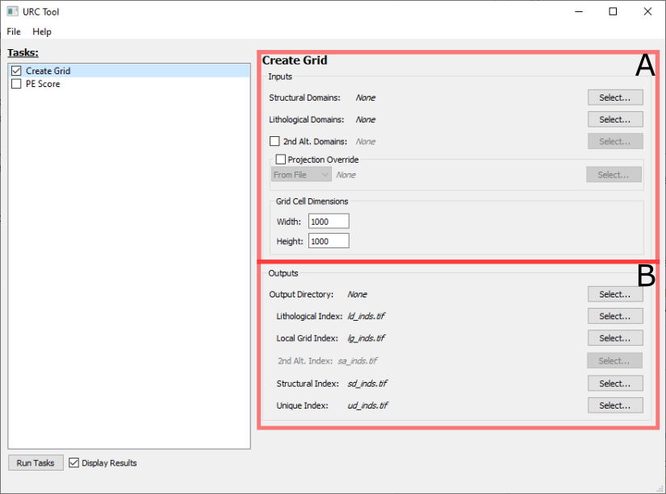

Create Grid Task
================

The Create Grid task panel is broken down into two sections _Inputs_ (**A**) and _Outputs_ (**B**)

A. Inputs
---------

The following fields are paths to vector *.shp files containing polygons ideally derived using the STA Method as 
outlined in {cite:t}`sta2019`:

* ***Structural Domains***: A polygon layer representing structural domains. Required.
* ***Lithological Domains***: A polygon layer representing lithological domains. Required.
* ***2nd Alt. Domains:*** A polygon layer representing secondary alteration domains. This is optional, and only included
  if the box to the left of the prompt is checked.

By default, the output layers will use the projection/coordinate system of the ***Structural Domains*** layer. This can
be overriden by checking the ***Projection Override*** box and doing one of the following:

* Select *From File* from the dropdown menu and selecting a `*.prj` file with the desired projection.
* Select *From EPSG* from the dropdown menu and entering a valid [EPSG code](https://epsg.io/).

The ***Grid Cell Dimensions*** box contain the final two input fields (***Width*** and ***Height***) which define the 
dimensions of an individual grid cell (pixel). The units for this value correspond to the projection/coordinate system
to be applied to the result files as described above.

B. Outputs
----------

The output files are all rasters which represent gridded data as a result of processing. This data can be processed
independently, or used as inputs for the [PE Score Task](pe_score_task.md).

By default, the ***Output Directory*** specifics where all the output files should go. Individual file locations and names
can be overridden using the ***Select...*** button to the right of the respective file.

The following files are produced as the part of the _Create Grid Task_:

* ***Lithological Index***: The raster-based index grid derived from the input ***Lithological Domains***.
* ***Local Grid Index***: The unique identifier for each grid cell.
* ***2nd Alt. Index***: The raster-based index grid derived from the input ***2nd Alt. Domains***. This field is only
  enabled if the ***2nd Alt. Domains:*** is checked in [Inputs](#a-inputs)
* ***Structural Index***: The raster-based index grid derived from the input ***Structural Domains***.
* ***Unique Index***: The Id derived by combining ***Lithological***, ***Structural***, and ***2nd Alt.*** (if active) raster
  indices.
