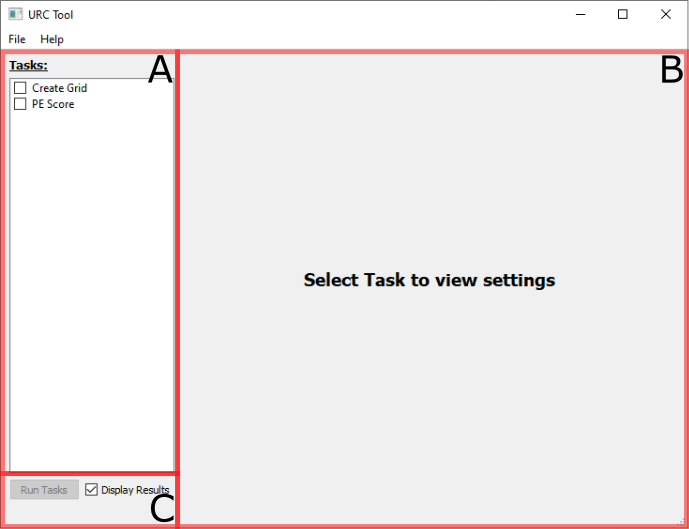

Main Window
===========

When the tool is first launched the above panel is displayed. The main view can be broken down into three sections:

* **A. Task list:** This is the list of operations to be carried out when the ___Run Tasks___ button is clicked. Only
  checked tasks will be executed, in sequence.
* **B. Pane View:** This section displays the settings for the selected task in the adjacent **Task List**. Each
  task and its configurations will be discussed in more detail in the subsequent sections.
* **C. Run Options:** The ___Run Tasks___ button will execute all checked tasks when clicked; the button will be 
  disabled if no tasks are checked. The ___Display Results___ checkbox indicates if the results will be displayed in
  a preview window when the tasks conclude; see the [results section](results.md) for more details.

This tool is divided up into several tasks. Presently the following tasks are available:

* [__Create Grid__](create_grid_task.md) - Converts geologic domain vector layers into index rasters to feed the
  **PE Score** task. 
* [__PE Score__](pe_score_task.md) - Calculate the likelihood of the presence, or Potential Enrichment (PE), of Rare-Earth Elements and Critical
  Minerals based on _Data Available_ (DA) and _Data Supporting_ (DS) resources evaluated per the DA/DS steps of the URC assessment method.
