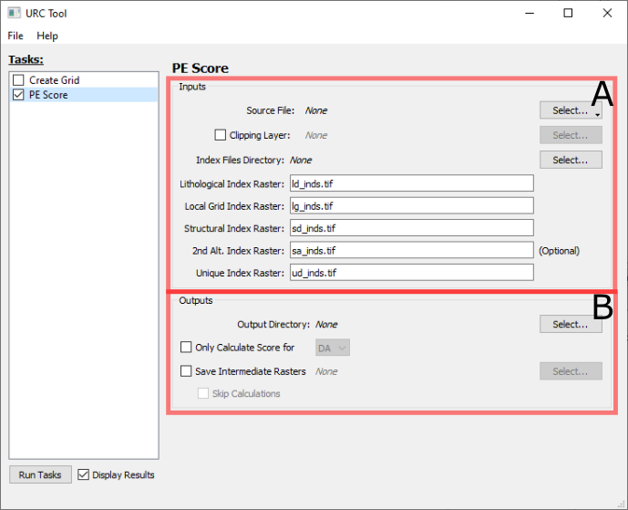

PE Score Task
=============

The PE Score task panel is broken down into two sections _Inputs_ (**A**) and _Outputs_ (**B**)

A. Inputs
---------

The ***Source File*** is either a `*.gdb` directory or a `*.sqlite` (Spatialite) file; this should contain the layers of
vector data to be scored, labeled according to the criteria described in {cite:t}`CREASON2022`

By default, the result data conforms to the extents of the input index rasters; oftentimes, the region of interest is 
smaller and more detailed than the regions covered by the combined index rasters. In these cases, a clipping `*.shp` 
file can be provided by checking the ***Clipping Layer*** and selecting the file.

_The following fields are only present if the [Create Grid](create_grid_task.md) task is unchecked; otherwise, these 
values are taken from the outputs of the [Create Grid](create_grid_task.md) task._

The ***Index Files Directory*** should correspond to the outputs directory specified in a Create Grid run. The individual 
Raster file names can either be absolute paths, or relative to this directory. 

If any of the raster path names appear in
red text are filenames that do not appear in the ***Output Directory*** and should be 
corrected.

All the index raster names refer to the output fields in the [Create Grid](create_grid_task.md) task; the ***2nd Alt. 
Index Raster*** field is optional, and can be left blank if not needed/present.

B. Outputs
----------

There are a variety of raster score results which are saved as a result of the scoring calculations. Most calculations
will be saved in GeoTIFF format in the chosen ***Output Directory***.

By default, both _Data Available_ (DA) and _Data Supporting_ (DS) data are scored; however, the scoring process can be 
limited to only one of those options by checking ***Only Calculate Score for*** and selecting either "DA" or "DS".

The processing of the indices and input data layers is a multistep process; to save values from the intermediate steps, 
check the ***Save Intermediate Rasters*** box and select a destination directory to the right. If only the intermediate 
rasters are of interest, the ***Skip Calculations*** box can be checked; this will bypass the final scoring calculations,
and is mainly useful for troubleshooting purposes.
