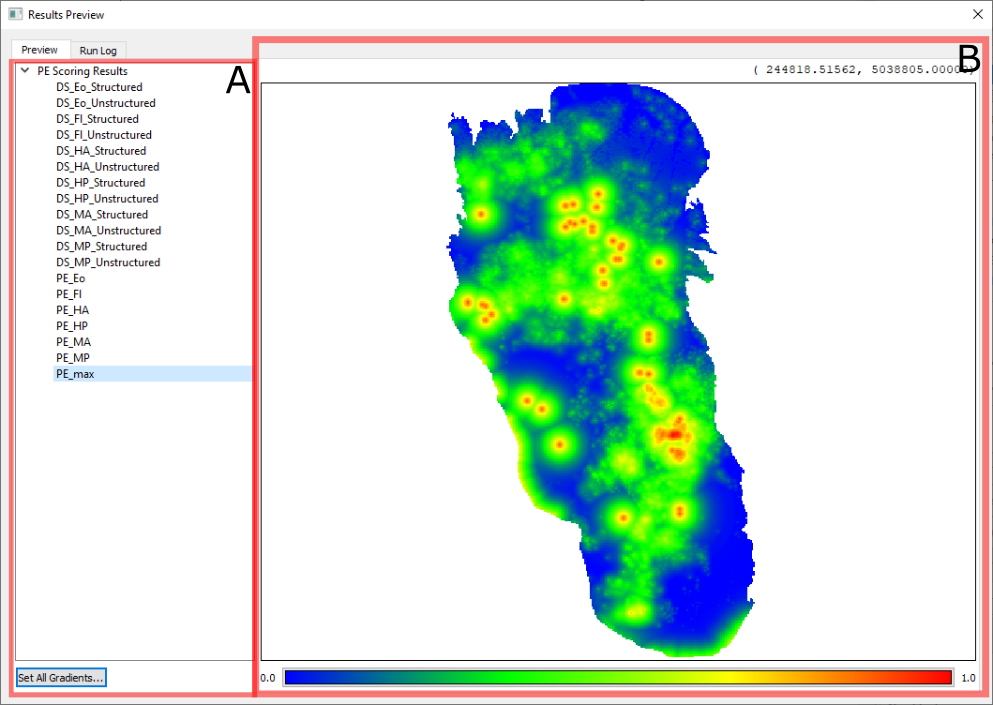

Results Preview
===============

If the ***Display Results*** box is checked, in the [main window](main_window.md), than the **Results Preview** dialog 
will appear after all tasks complete successfully. This dialog has two tabs available; the ***Run Log*** tab contains
the log output that created the session that created the results of this preview. The contents of the ***Preview*** tab 
is the subject of the remainder of this section.

A. Results List
---------------
The ***results*** list pane on the left side of the view lists the output rasters under the heading with the name of 
the task which generated them. Clicking on and selecting a result file will open a preview in the 
[Preview Pane](#b-preview-pane) on the right.

Clicking on the ***Set All Gradients...*** brings up the **Gradient Dialog**, and will apply the chosen color ramp for 
all results, essentially setting the "default" color ramp / gradient for any viewed result.

B. Preview Pane
---------------

The ***Preview Pane*** displays the results selected in the [Results List](#a-results-list) on the left side of the 
view. Clicking on the gradient button at the bottom of the view brings up the **Gradient Dialog**, which will update the 
result being actively previewed with the new chosen gradient colors on return.

The coordinates of the mouse pointer location in the active result view will appear above the ***Preview Pane*** when
the mouse cursor is positioned within its bounds.

The ***Preview Pane*** can be interacted with directly using the mouse. The following table outlines mouse interaction 
behavior:

| Button | Action                                                                                                                                                                   |
|:-------|:-------------------------------------------------------------------------------------------------------------------------------------------------------------------------|
| Left   | Click-and-dragging this button pans the preview scene.                                                                                                                   |
| Right  | Click-and-dragging produces a rubber band box, which is zoomed to on release.                                                                                            |
| Wheel  | Rolling forward zooms into the scene; rolling backward zooms out from the scene.  Holding _Shift_ or _Shift-Ctrl_ causes the steps to decrease in smaller increments |
